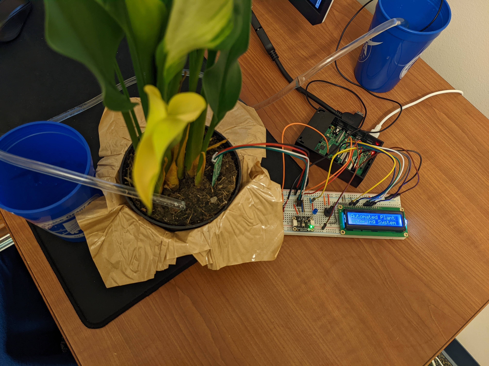
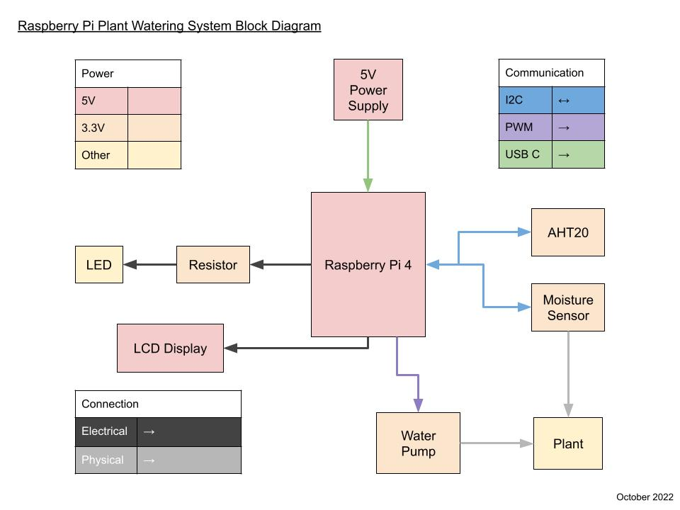
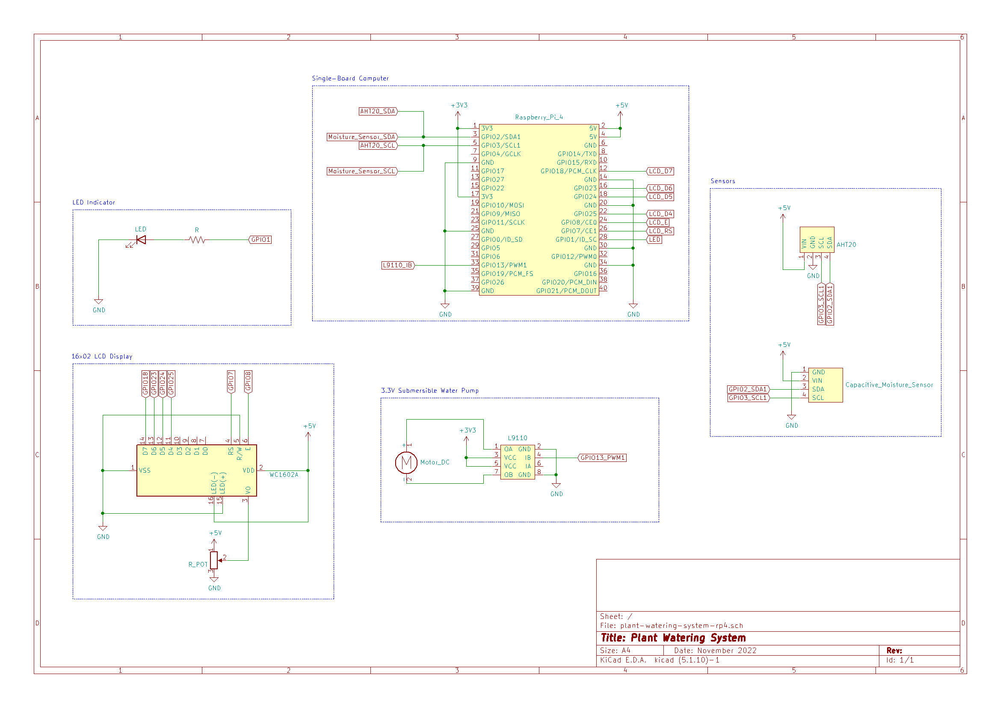
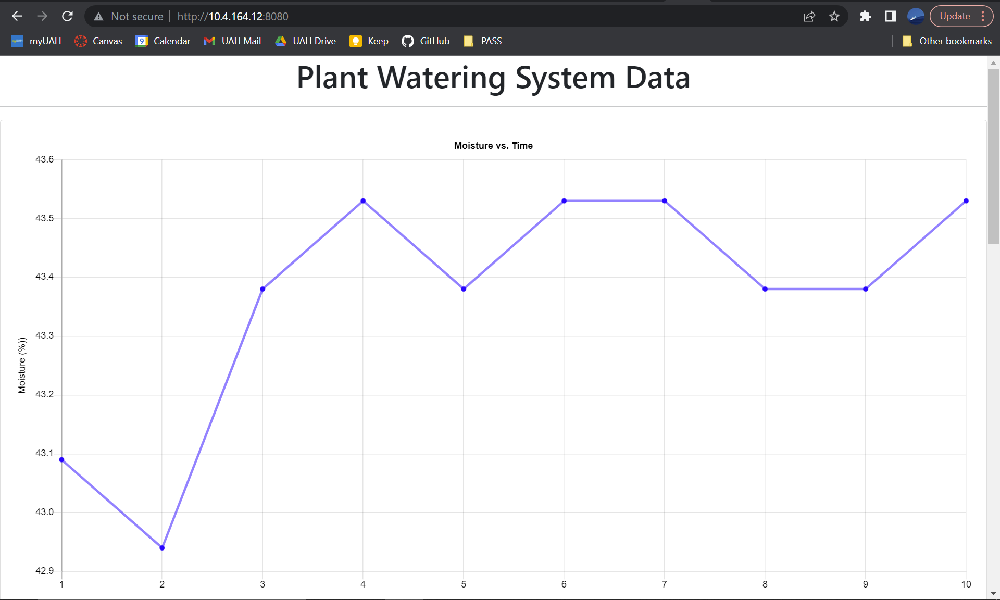

# plant-watering-system

Project created for HON301 Rapid Prototyping Seminar with Dr. David Chan in Fall 2022.

Automated plant watering system with web server graphics using a Raspberry Pi 4.

Note: Program intended to work in a Linux environment

### Block Diagram

### Electrical Schematic

### Web Server with Data Plots

Additional info to be added soon...
